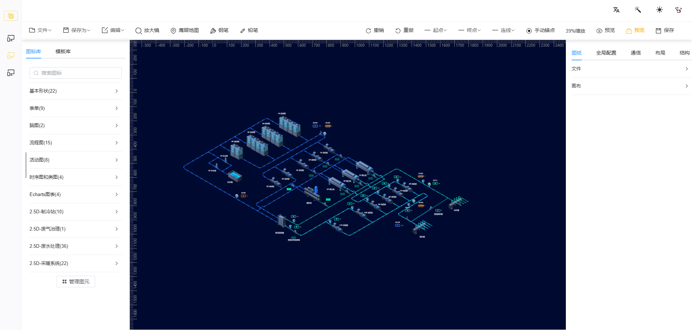
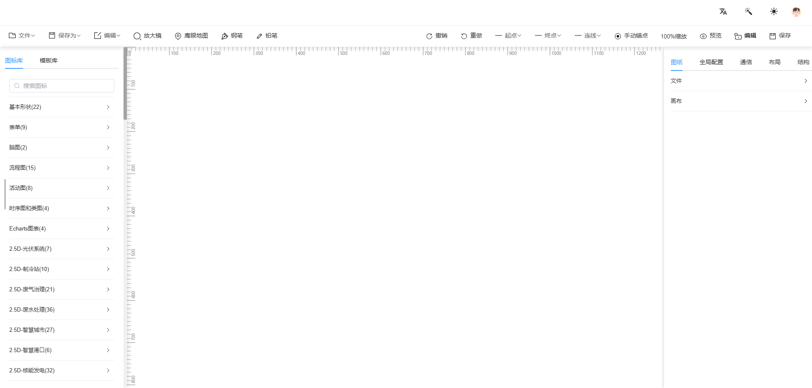

<div align="center">

<h1>Low Code Thingsboard</h1>

</div>

## 简介

**Low Code Thingsboard** 由 **Vue3**、**Vite**、**TypeScript** 和 **Monorepo** 构建并集成Thingsboard数据订阅功能以及 **2D组态图** 的「数据可视化」低代码开发平台

**Low Code Thingsboard** 基于开源项目 [go-view](https://gitee.com/dromara/go-view) 进行二次开发，并集成了 [thingsboard](https://thingsboard.io/) 前端核心代码**core** ，可通过配置 **thingsboard** 的账号直接登录实现数据的订阅，并在图表中直接呈现数据。

**Low Code Thingsboard** 在 [go-view](https://gitee.com/dromara/go-view) 基础上添加了对 **2d组态图** 的支持，并包含组态图设计器。基于 **tingsboard** 的部件库正在开发中...

## 技术点：

- **最新技术栈**：使用 Vue3/vite 等前端前沿技术开发
- **TypeScript**: 应用程序级 JavaScript 的语言
- **框架**：使用 [Turborepo](https://turbo.build/repo/docs) 搭建的monorepo项目，支持多包共享。
- **tingsboard**：使用v3.8.0版本，支持 thingsboard 新的数据订阅功能，实现了dashboard内的 **Alias**、**keyFilter**、**Timewindow** 组件。
- **组态图**：增加了对2d组态图的支持，以及组态图设计器。

## 版本

- thingsboard v3.8.0
- go-view v1.3.1

## 获取帮助

- 获取 **thingsboard核心订阅源码** 以及 **完整版组态图编辑器** 和其他问题咨询请加QQ，备注来源。

- QQ: 849082187

## 完整版 Low Code Thingsboard

- 完整的thingsboard订阅功能。

- 完整的组态图编辑功能。

- **60** 多种分类、**2000** 多张图形的组态图设计资源。

## 组态图

- 组态图

<p align="center" style="margin-top:20px">
    
    
    
</p>

- 基础版编辑器

<p align="center" style="margin-top:20px">
    
</p>

- 完整版编辑器

<p align="center" style="margin-top:20px">
    
    
</p>

## 安装使用

- 获取项目代码

```bash
git clone https://github.com/siluozhang516/low-code-thingsboard.git
```

- 安装依赖

```
cd low-code-thingsboard

pnpm install
```

- 运行

```
turbo dev

turbo dev --filter=low-code-view
```

- 打包

```
turbo build
```

- thingsboard代理配置

```
   proxy: {
      '/api': {
        target: '', //http地址
        changeOrigin: true,
        rewrite: p => p.replace('/^/api/', '')
      },
      '/api/ws': {
        target: '', //ws地址
        changeOrigin: true
      }
    }
```
